# Sub Project 3

- 팀장 : 배진영
- 팀원 : 김소희, 강찬엽
- 프로젝트 명 : Blocook (블로쿡)
- URL: https://i3a505.p.ssafy.io  (* 블로쿡은 모바일웹입니다. 꼭 F12를 눌러 개발자모드를 킨 후 Ctrl+Shift+M을 눌러 핸드폰 화면으로 봐주세요!) 
- 음성인식(STT), 음성합성(TTS) 기능 지원 환경 :
  PC - 크롬 브라우저
  Mobile - 안드로이드 + 크롬, 삼성 인터넷 브라우저

## 개요

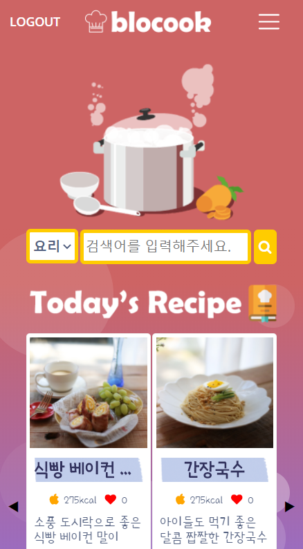

Blocook은 Blog와 Cooking의 합성어로서 **Blocook(블로쿡)** 이란 이름을 갖게 되었습니다.

블로쿡은 나만의 레시피를 올리고 다른 사람의 레시피를 따라해보며 서로의 레시피를 공유할 수 있는 레시피 전용 블로그입니다.

블로쿡에서는 **핸즈프리**로 레시피를 볼 수 있는 레시피 플레이 기능과 여러가지 재료로 레시피를 검색할 수 있는 기능을 제공합니다.  

## 아키텍처

**Spring Boot** 를 이용하여 백엔드 REST API를 구현하였고 **Vue.js 프레임워크**를 이용하여 프론트 단을 구현하였습니다.
레시피 정보 조회 및 검색과 같은 요청 발생 시 프론트단에서 서버와 비동기 통신하여 JSON 형태로 응답 결과를 받아와 처리 후 보여줍니다.

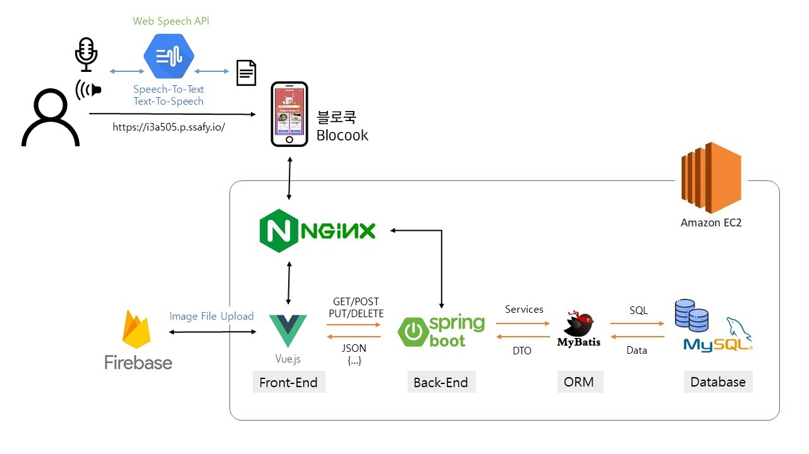

### 1. 음성인식(STT) & 음성합성(TTS)

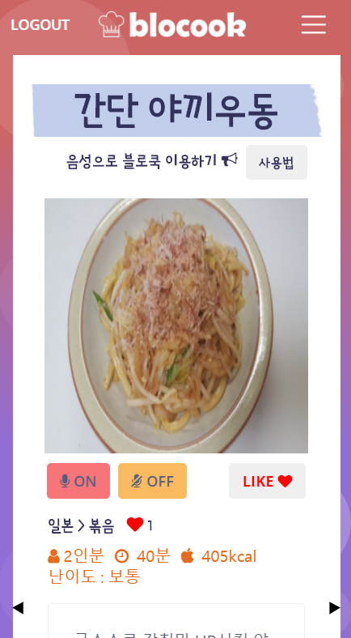

Web Speech API를 사용한 음성 인식 기능

Clova CSS API를 사용한 음성 합성 기능

* 시나리오
  1. 레시피 상세보기 페이지로 이동 후 자동으로 마이크가 켜지며(허용할 시) 음성 합성 기능이 자동으로 실행되어 레시피를 읽어줍니다.
  2. ON버튼을 이용하여 마이크를 켜고 OFF버튼 또는 "마이크 꺼줘"를 통해 마이크를 끌 수 있습니다.
  3. "다음"을 음성으로 말하면 다음 과정의 레시피를 확인할 수 있으며 "이전"을 통해 전 과정의 레시피를 확인할 수 있습니다. 또한 과정 이동마다 과정 설명을 음성으로 읽어줍니다.
  4. "다시"를 통해 과정 설명을 다시 들을 수 있습니다.

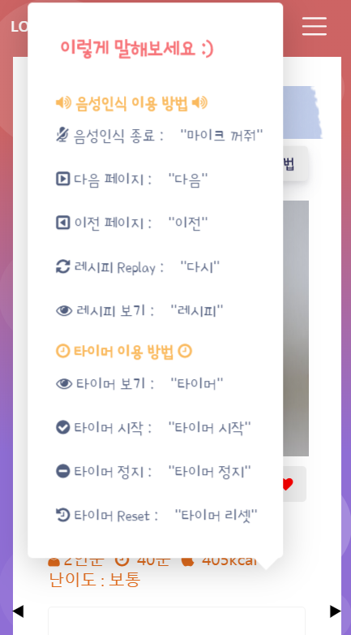

레시피 상단의 사용법 버튼을 클릭하여 음성인식 사용법을 확인할 수 있습니다.

### 1.2 타이머 기능

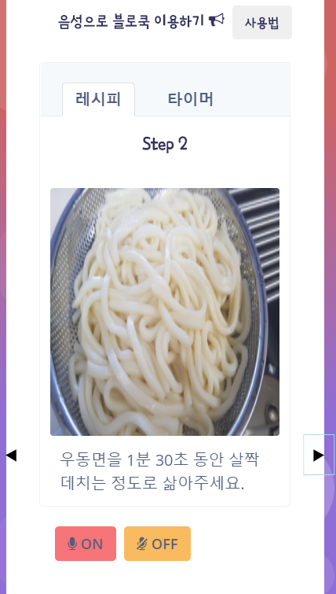

레시피 과정 중  타이머가 필요한 레시피는 레시피탭과 타이머탭으로 나눠집니다.

마이크가 켜진 상태로 "타이머"를 말할 시 타이머 탭으로 이동하며 레시피를 말하면 다시 레시피로 돌아오게 됩니다.

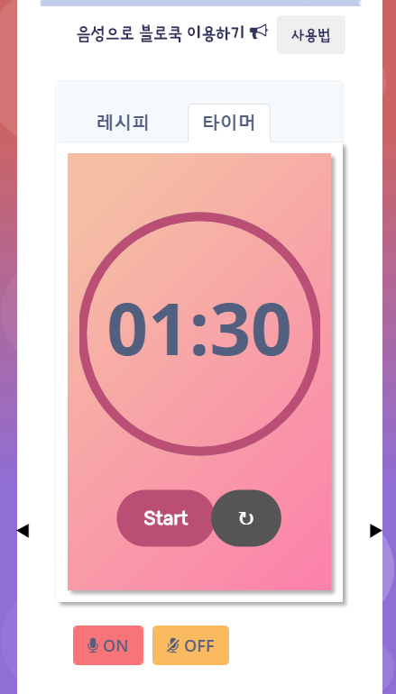

타이머 화면에서 "타이머 시작"을 말할 시 타이머가 시작하게 되며 "타이머 정지"에 정지하며 "타이머 리셋"을 통해 타이머의 시간을 돌릴 수 있습니다. 또한 버튼을 통해서도 가능합니다.

타이머의 남은 시간이 0이 될 시 타이머에서 알람이 울립니다.

### 2.  레시피 검색

#### 2.1 재료 검색

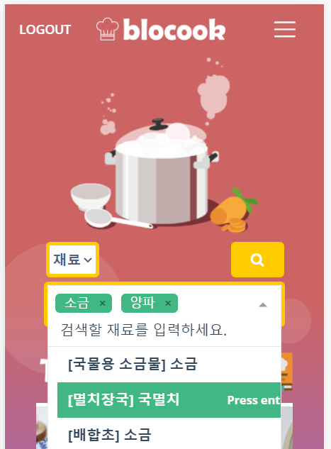

* 시나리오
  1. 메인 페이지의 검색창 또는 검색 페이지의 검색창의 셀렉트 박스에서 재료를 선택
  2. 원하는 재료를 입력, Selector에서 재료 선택 또는 해당하는 재료가 없는 경우에도 검색 가능
  3. Multiselector 기능을 통해 여러가지 재료로 검색 가능 
  
  

#### 2.2 요리 제목 검색

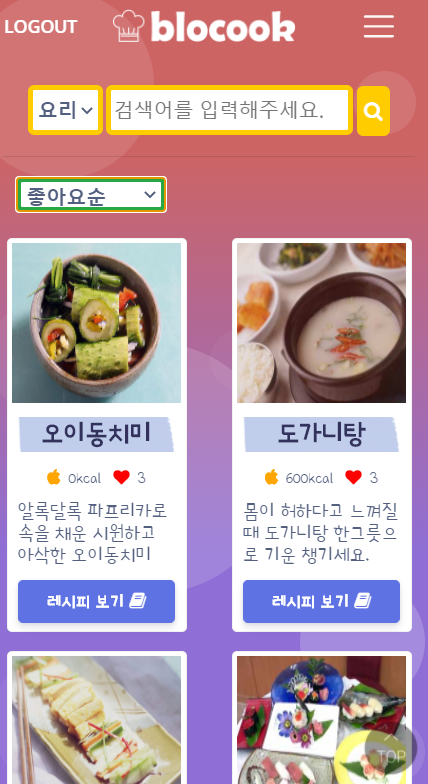

* 시나리오
  1. 메인 페이지의 검색창 또는 검색 페이지의 검색창의 셀렉트 박스에서 요리를 선택
  2. 원하는 요리 제목에 해당하는 단어를 검색 (부분적으로 해당해도 상관없음)

### 3. 정렬 기능

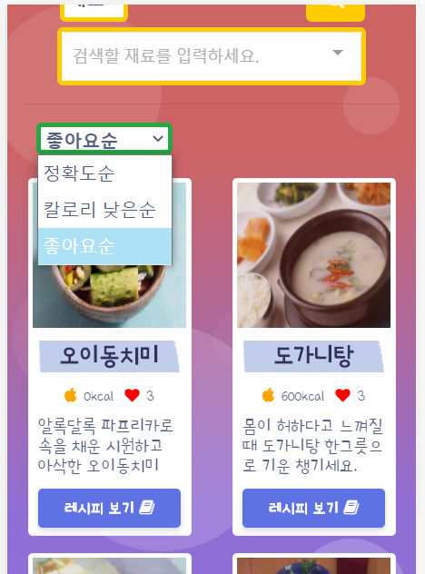

검색을 한 후 해당하는 레시피들을 정확도, 칼로리 낮은순, 좋아요순으로 정렬할 수 있습니다.

### 4. 커뮤니티 기능 (요리톡 조리톡)

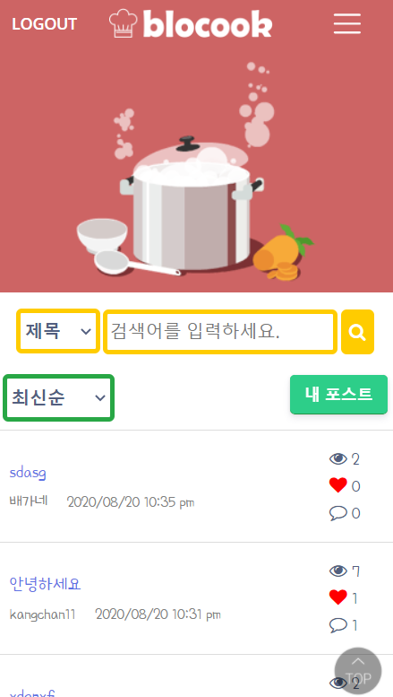

nav바의 요리톡 조리톡 버튼을 통해 커뮤니티 페이지로 이동할 수 있습니다.

커뮤니티 페이지의 검색 기능은 제목, 작성자를 선택하여 검색할 수 있습니다.

커뮤니티 페이지의 정렬 기능은 최신순, 조회순, 좋아요순으로 사용할 수 있습니다.

#### 4.1 글쓰기 기능

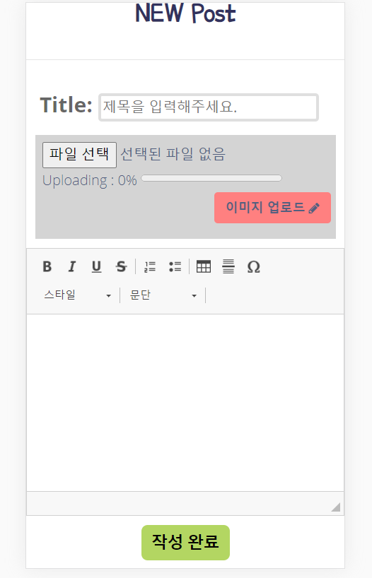

에디터를 구현하여 사용합니다.

* 시나리오
  1. 로그인(필수)을 한 후 커뮤니티 페이지의 좌측 녹색 버튼을 클릭하고 새 글 쓰기를 선택
  2. 제목(필수), 내용(필수), 이미지(선택)을 입력하고 작성 완료 버튼을 눌러 커뮤니티 페이지에 글을 남길 수 있습니다.

#### 4.2 댓글  기능, 좋아요 기능

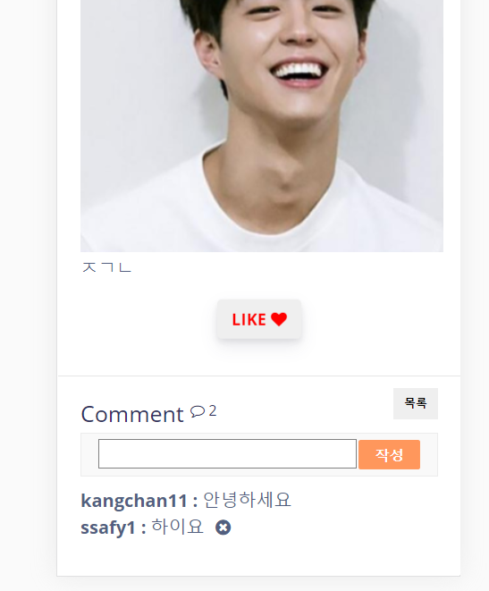

* 시나리오
  1. 커뮤니티 페이지에서 아무 게시글이나 제목을 눌러 상세보기로 이동
  2. 하단 코멘트 위의 좋아요 버튼을 통해 좋아요 가능 (로그인 필수)
  3. Comment 작성창에 댓글을 입력하여 댓글을 남길 수 있으며 자신의 댓글 옆에만 표시가 나타나는 x표시를 통해 삭제할 수 있습니다.

#### 4.3 자기가 작성한 글, 댓글 확인 기능

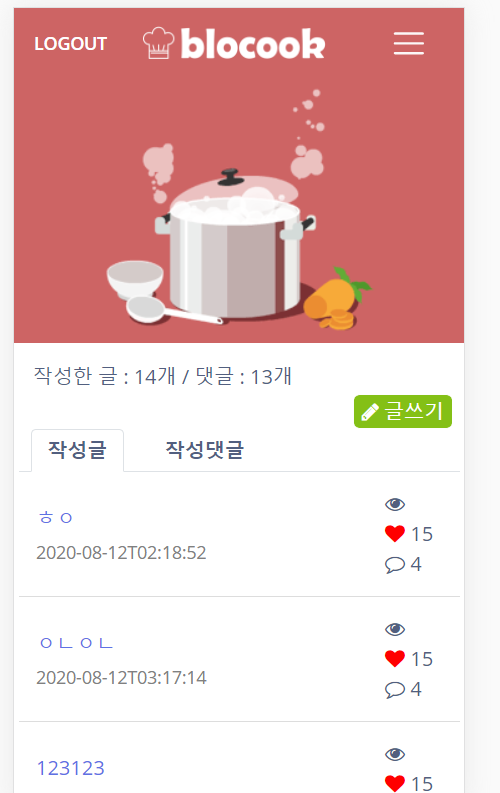

*  시나리오
  1. 커뮤니티 페이지의 녹색버튼 눌러 내 포스트로 이동
  2. 작성글 탭에서 작성한 글을 확인 할 수 있으며 작성댓글에서 직접 작성한 댓글을 확인할 수 있습니다.

### 5. 레시피 등록

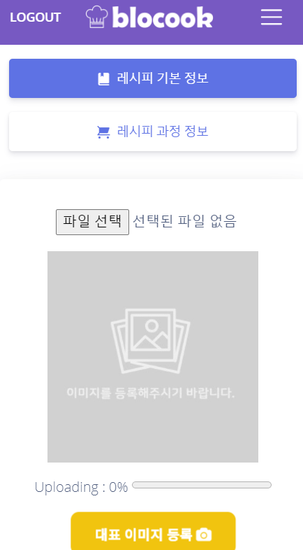

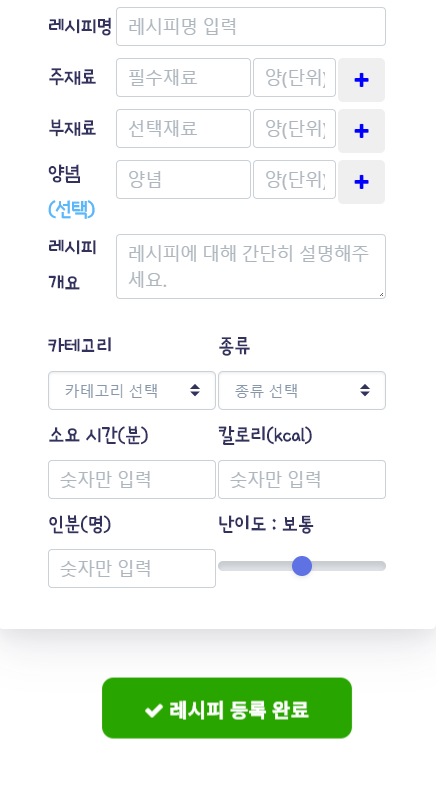

자신만의 레시피를 등록하고 싶은 경우 마이페이지 화면에서 '레시피 등록' 버튼을 클릭하면 위와 같은 화면으로 전환됩니다.

대표 이미지와 레시피에 들어가는 정보들을 입력한 후 상단에 보이는 '레시피  과정 정보'를 눌러 아래 화면으로 이동합니다.

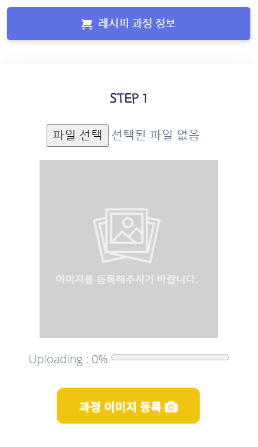

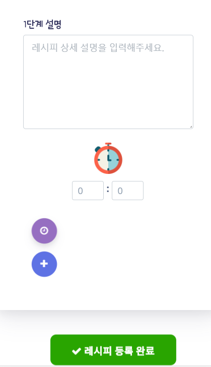

레시피 상세 등록 화면에서는 레시피의 진행 단계별로 정보를 등록할 수 있으며 타이머를 등록할 수 있습니다.

완료시에는 하단에 위치한 '레시피 등록 완료' 버튼을 눌러 레시피 등록을 마칠 수 있습니다.

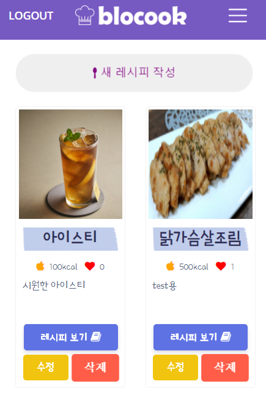

마이페이지에서 '내 레시피' 버튼을 클릭하여 위와 같이 지금까지 자신이 작성한 레시피들을 모아볼 수 있습니다.

### 6. 카테고리

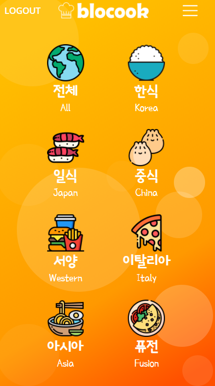

nav바의 토글에서 카테고리를 클릭하여 위와 같은 페이지로 이동합니다.

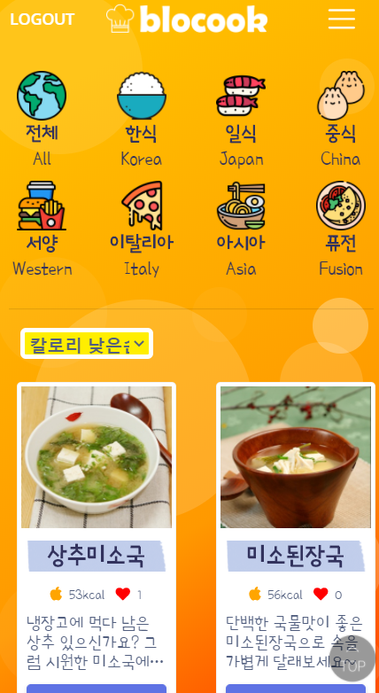

원하는 카테고리를 선택하면 해당 카테고리의 모든 레시피들이 나타나게 되며 칼로리 낮은 순, 좋아요순 두 가지의 정렬 방법을 사용할 수 있습니다.

### 7. 회원 관리

#### 7.1 회원 가입

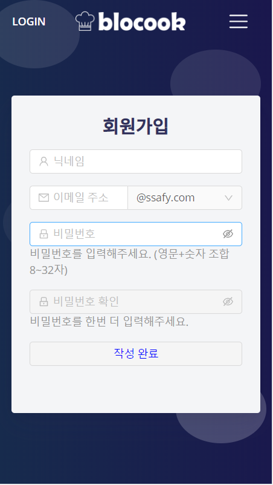

입력 란의 모든 기입 조건을 만족하는 경우 작성 완료 버튼이 활성화되고 회원가입을 진행할 수 있습니다.

* 시나리오
  1. 이름 (닉네임) 입력 - 필수 입력
  2. 이메일 주소 입력 - 필수 입력
  3. 비밀번호 입력 (비밀번호가 조건을 만족하는지에 따라 메시지 출력) - 필수 입력
  4. 비밀번호 확인 입력 - 필수 입력 (비밀번호가 일치하는지에 따라 메시지 출력하고 비밀번호란이 공란인 경우 비활성화)
  5. 버튼을 누르면 회원가입 완료 알림이 뜬다.

#### 7.2 로그인

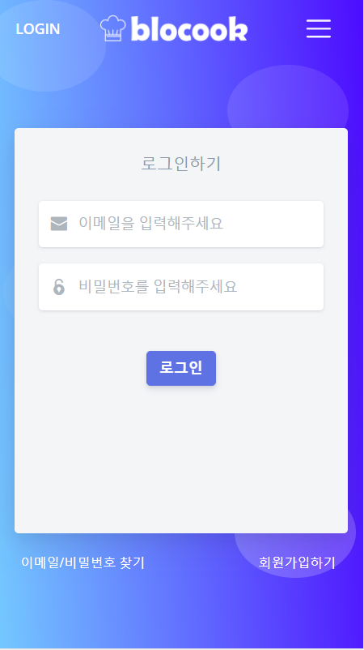

nav바의 좌측에 위치한 로그인 버튼을 누르면 위와 같이 로그인을 진행할 수 있습니다.

* 시나리오

  1. 이메일 입력

  2. 비밀번호 입력

  3. 로그인 성공 후 메인 홈으로 이동한다.

     3.1. 로그인이 실패한 경우 알림이 뜬다.

####  7.3 로그아웃

로그인 상태에서 홈 화면 좌측 상단에 위치한 로그아웃 버튼을 눌러 진행할 수 있습니다.

#### 7.4 이메일 / 비밀번호 찾기

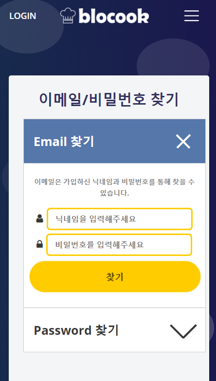

* 이메일 찾기 시나리오
  1. 닉네임과 비밀번호를 입력
  2. 닉네임과 비밀번호 모두 해당하는 이메일이 알림으로 뜹니다.
* 비밀번호 찾기 시나리오
  1. 이메일과 닉네임을 입력
  2. 이메일과 닉네임 모두 해당하는 비밀번호 알림으로 뜹니다.

#### 7.5 내 정보 조회 및 수정, 탈퇴

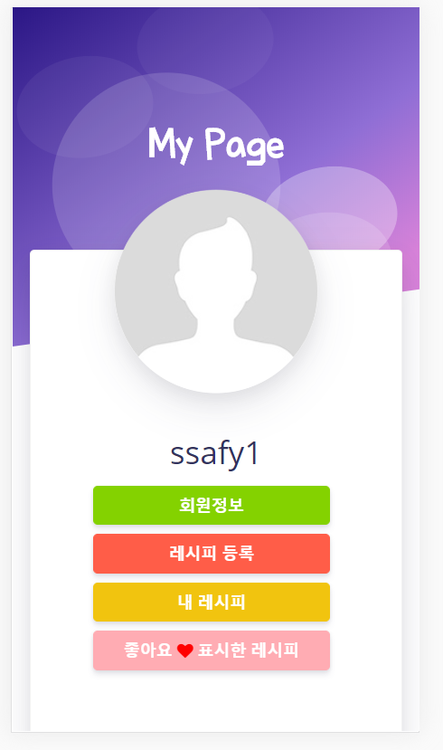

마이페이지의 회원정보 버튼을 누르면 아래와 같이 내 정보를 수정할 수 잇는 화면으로 전환되고 회원정보를 수정하거나 서비스를 탈퇴할 수 있습니다. (비밀번호 확인과 비밀번호가 일치할 시)

 또한 이미지 업로드를 통하여 프로필 사진을 등록할 수 있습니다. 

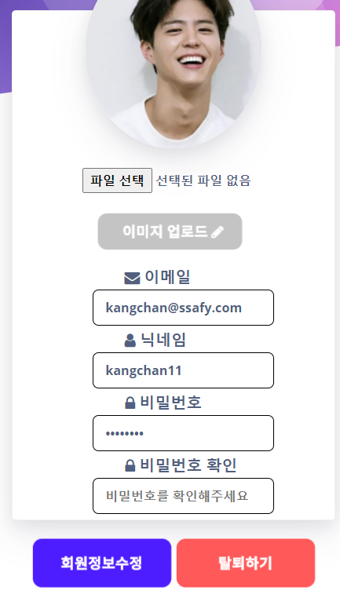

#### 7.6 내가 좋아요한 레시피

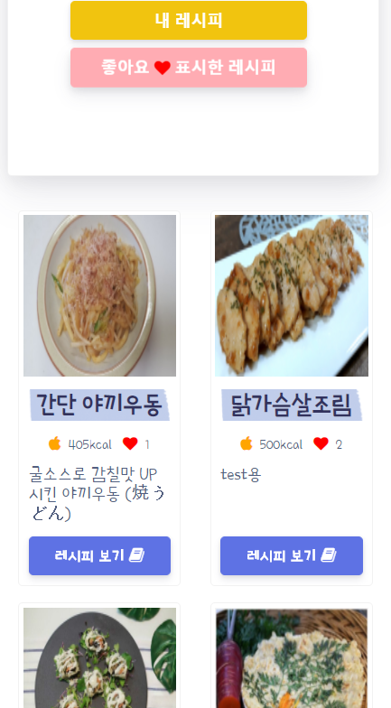

마이페이지에서 맨 아래 해당하는 좋아요 표시한 레시피 버튼을 클릭할 시 좋아요한 레시피 목록을 확인할 수 있습니다.

## 개발 환경

- Windows 10
- Spring Tool Suite 4
- Visual Studio Code

## 기술 스택

#### 백엔드
- Spring Boot 2.3.1
- MyBatis
- Gradle
- MySQL
- AWS EC2
#### 프론트엔드
- Vue.js
- Axios
- bootstrap-vue
- vuex

## DB 스키마
#### user 테이블
  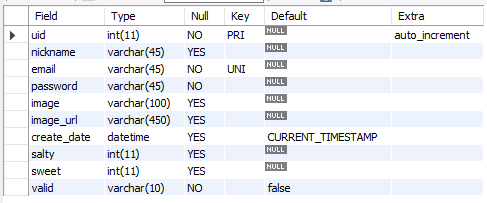

회원 정보를 담고 있는 테이블입니다.

#### recipe 테이블
  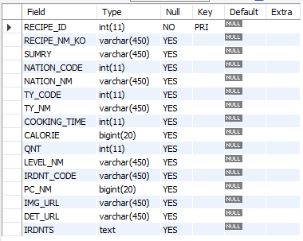

레시피의 이름이나 칼로리와 같은 기본정보를 담고 있는 테이블입니다.

#### recipe_cooking 테이블
  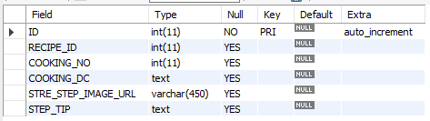

레시피 과정(스텝)에 대한 정보를 담고 있는 테이블입니다.

#### recipe_irdnt 테이블
  

해당 레시피에 필요한 재료 정보를 담고 있는 테이블입니다.

#### irdnt 테이블
  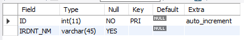

모든 재료 이름 정보를 담고 있는 테이블입니다.

#### recipe_bookmark 테이블
  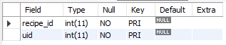

사용자의 레시피 즐겨찾기 기록 정보를 담고 있는 테이블입니다.

